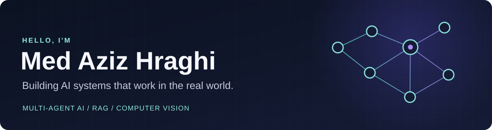

  

   

  <a href="https://www.linkedin.com/in/med-aziz-hraghi/">LinkedIn</a> ·
  <a href="mailto:medazizhraghi@gmail.com">Email</a> ·
  <a href="https://github.com/azizhraghi?tab=repositories">All repositories</a>

## About me

I'm an engineering student at **ENSTAB** in Tunisia, specializing in digitalisation and data analysis. I build AI applications across multi-agent systems, retrieval-augmented generation, and computer vision—usually taking an idea from model and workflow design through to a usable interface.

The work I enjoy most sits where AI meets a real problem: helping students practice professional work, making study sessions more adaptive, improving recruitment workflows, and explaining evidence in image forensics.

## Selected work

| Project | What it does | Stack |
| :-- | :-- | :-- |
| [**Syntern**](https://github.com/azizhraghi/stagi) | Simulates a remote internship with four AI teammates, tasks, voice conversations, and behavioral feedback. **2nd place, TBS Atlas Hackathon.** | React · n8n · Supabase · ElevenLabs |
| [**GROOV**](https://github.com/azizhraghi/groov) | Creates an AI study group with distinct teaching personas and document-grounded answers with page citations. | FastAPI · Ollama · FAISS · Sentence Transformers |
| [**AgenticHire**](https://github.com/azizhraghi/agentic_hire) | Connects candidates and recruiters through specialized AI agents for job matching, CV analysis, and recruitment tasks. **3rd place, NerdData ENSI Hackathon.** | FastAPI · React · Mistral AI |
| [**Vendex**](https://github.com/azizhraghi/vendex) | Analyzes insurance claim images for manipulation and damage, then produces an explainable verdict. **Top 6 of 37 teams, GDGC FST Hackathon.** | Python · DINOv2 · MobileSAM · Mistral AI |

## Tools I use

**Languages:** Python · JavaScript · SQL · C / C++ · Java  
**AI & data:** PyTorch · Hugging Face · RAG · FAISS · computer vision · NLP  
**Apps & workflows:** FastAPI · React · Vite · Supabase · n8n · REST APIs

## Beyond code

I chair the **ACM ENSTAB Club**, helping run competitive programming training and contests. I'm also involved with the ElectroniX and IEEE ENSTAB communities.

If you're working on an AI product, an agentic workflow, or an applied computer vision problem, [let's connect](mailto:medazizhraghi@gmail.com).
