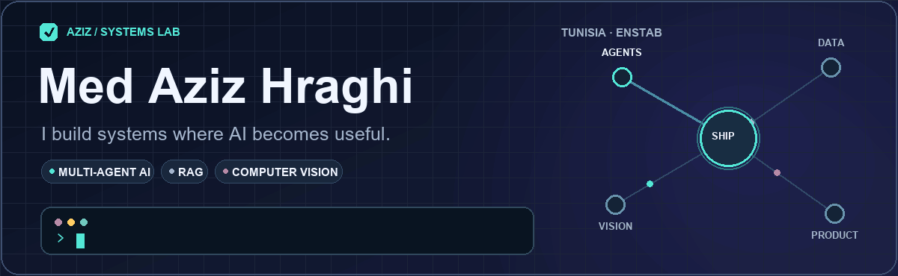
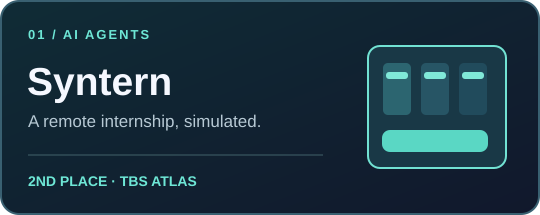
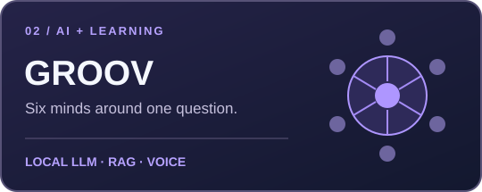
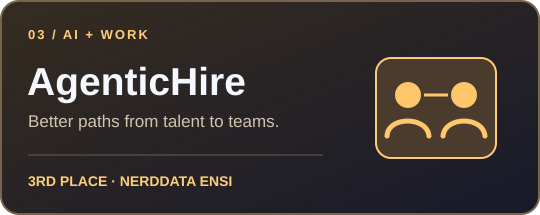
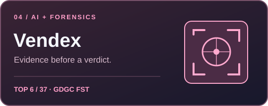

  

  

    <a href="https://www.linkedin.com/in/med-aziz-hraghi/">LinkedIn</a> ·
    <a href="mailto:medazizhraghi@gmail.com">Email</a> ·
    <a href="https://github.com/azizhraghi?tab=repositories">Explore my repositories</a>
  

### From model to something people can use

I'm an engineering student at **ENSTAB**, specializing in digitalisation and data analysis. I build AI products across **multi-agent systems, RAG, and computer vision**—connecting models to workflows, interfaces, and real users.

My favorite projects combine technical depth with a practical question: Can AI make learning more adaptive? Can an internship be practiced before day one? Can an image-forensics verdict explain itself?

### Selected builds

<table>
  <tr>
    <td width="50%" valign="top">
      
      
Four AI colleagues, a Kanban board, voice calls, and behavioral feedback in a simulated remote internship. <strong>React · n8n · Supabase · ElevenLabs</strong>

      <a href="https://github.com/azizhraghi/stagi">Explore Syntern →</a>
    </td>
    <td width="50%" valign="top">
      
      
An adaptive study room with six AI personas, local LLMs, voice, and answers grounded in uploaded course PDFs. <strong>FastAPI · Ollama · FAISS</strong>

      <a href="https://github.com/azizhraghi/groov">Explore GROOV →</a>
    </td>
  </tr>
  <tr>
    <td width="50%" valign="top">
      
      
Candidate and recruiter agents for job discovery, CV analysis, matching, and hiring workflows. <strong>FastAPI · React · Mistral AI</strong>

      <a href="https://github.com/azizhraghi/agentic_hire">Explore AgenticHire →</a>
    </td>
    <td width="50%" valign="top">
      
      
A five-layer image-forensics pipeline that combines anomaly detection, damage segmentation, and an explainable AI verdict. <strong>Python · DINOv2 · MobileSAM</strong>

      <a href="https://github.com/azizhraghi/vendex">Explore Vendex →</a>
    </td>
  </tr>
</table>

### The toolkit behind the work

| Build | Intelligence | Ship |
| :-- | :-- | :-- |
| Python · JavaScript · SQL · React · FastAPI | PyTorch · Hugging Face · Ollama · FAISS · computer vision | Supabase · n8n · REST APIs · Vite |

Outside projects, I chair the **ACM ENSTAB Club**, helping run competitive programming training and contests. I'm also active in the ElectroniX and IEEE ENSTAB communities.

  <h3>Have an idea worth building?</h3>
  
<a href="mailto:medazizhraghi@gmail.com">Let's talk</a> · <a href="https://www.linkedin.com/in/med-aziz-hraghi/">Connect on LinkedIn</a>

